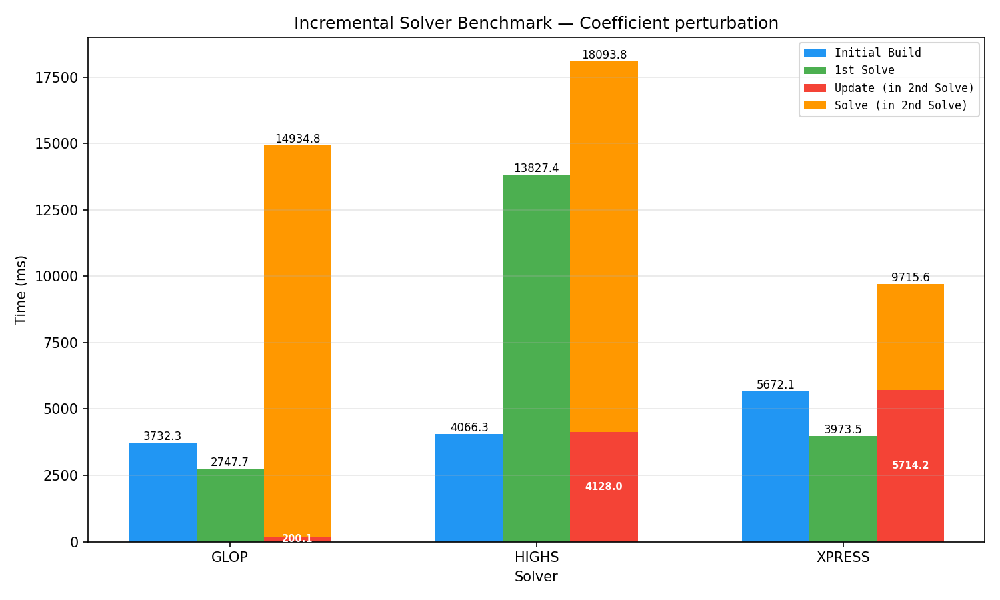
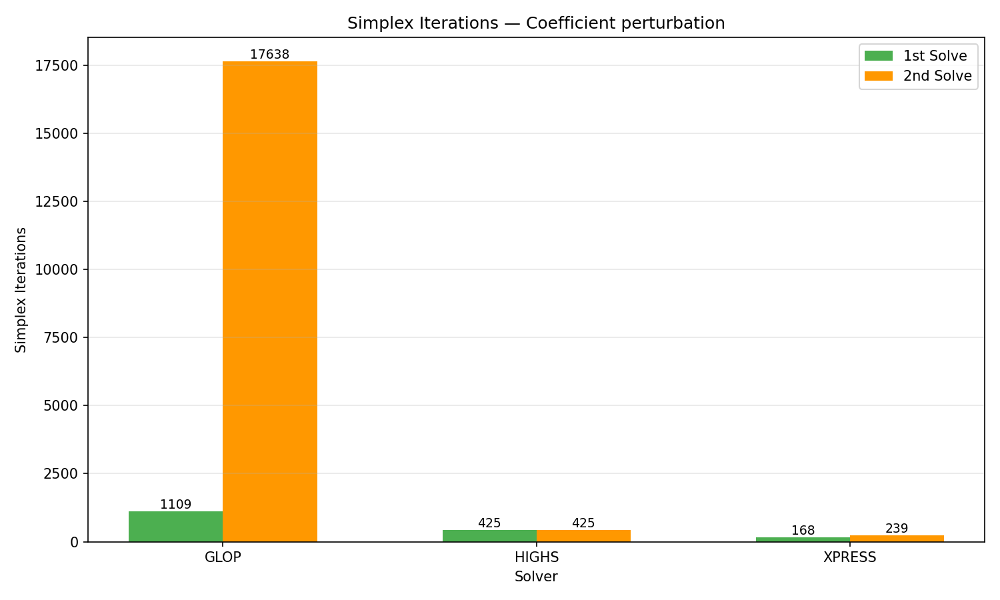
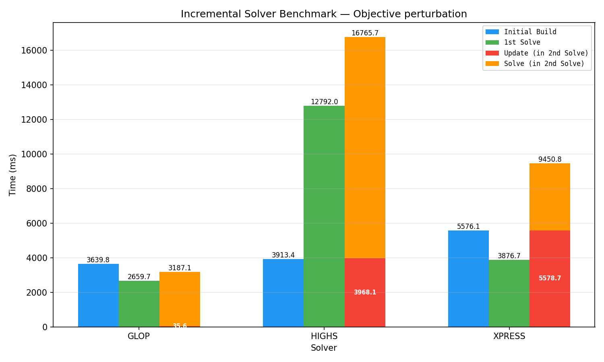
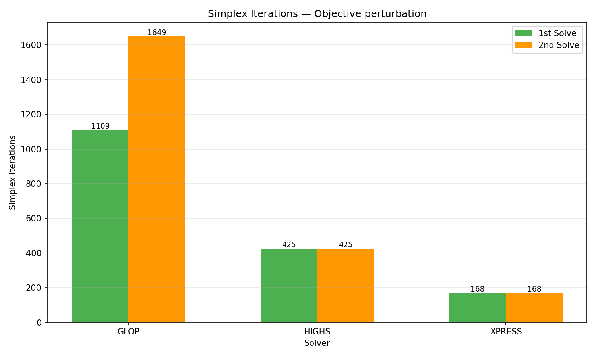
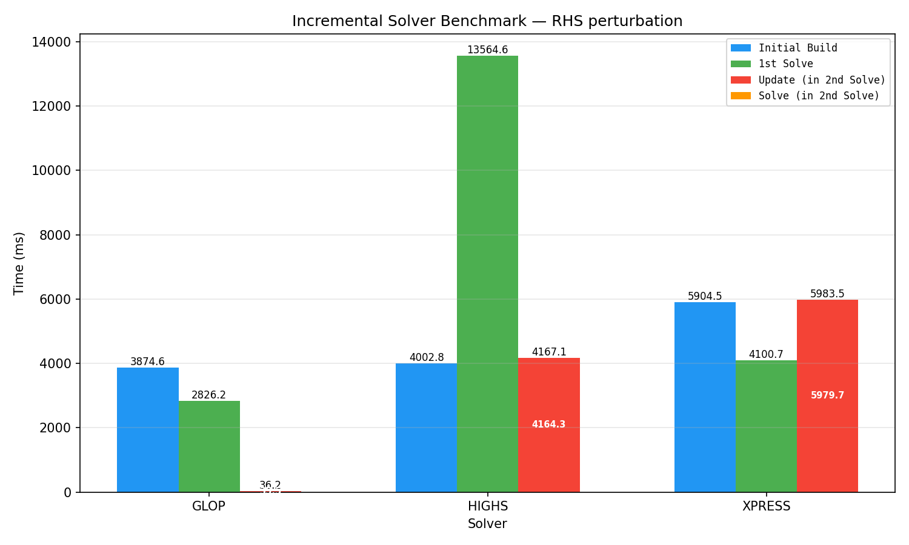
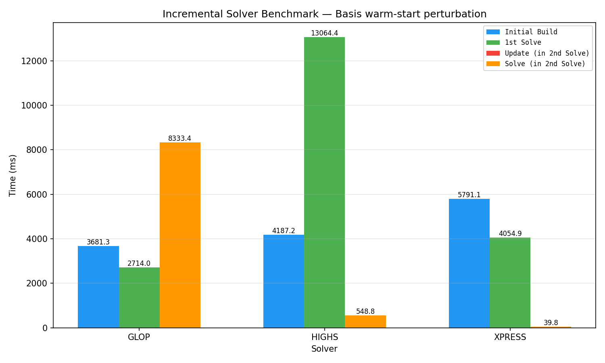
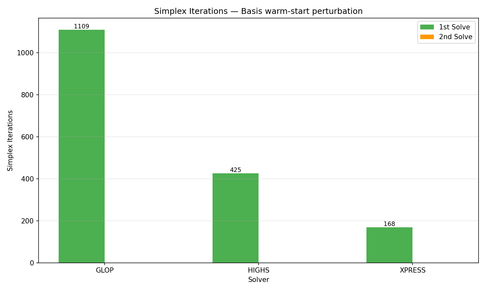

# MathOpt: Model Updates and Incremental Solving

## Two-Layer Architecture

MathOpt separates the **model representation** from the **solver representation**.

### Higher-level: Model Storage

The user works with `Model`, which owns a `shared_ptr<ModelStorage>`.
`ModelStorage` contains a `CopyableData` struct holding:

- `VariableStorage` -- variable bounds, integrality
- `ObjectiveStorage` -- direction, offset, linear/quadratic coefficients
- `LinearConstraintStorage` -- bounds + a **sparse matrix** of coefficients
- Various atomic constraint storages (quadratic, SOC, indicator, SOS, etc.)

There is no b-tree of terms like in MPSolver. The constraint coefficients live
directly in a sparse matrix (`SparseMatrix<LinearConstraintId, VariableId>`).
When you call `model.set_coefficient(c, x, 3.5)`, the value is written directly
into this matrix.

Key files:
- `ortools/math_opt/cpp/model.h` -- user-facing Model class
- `ortools/math_opt/storage/model_storage.h` -- storage layer
- `ortools/math_opt/storage/linear_constraint_storage.h` -- constraints + sparse matrix

### Lower-level: Solver Representation

Each solver (`GurobiSolver`, `XpressSolver`, etc.) maintains its own internal
representation (Gurobi's `GRBmodel`, XPress's `XPRSprob`, etc.). This is built
from a `ModelProto` -- a full protobuf serialization of the model.

The bridge between the two layers is:
- `model.ExportModel()` -- serializes the entire `ModelStorage` into a `ModelProto`
- `solver_factory(solver_type, model_proto)` -- creates a solver from that proto

---

## Two Solve Paths

MathOpt offers two ways to solve, defined in `ortools/math_opt/cpp/solve.cc`:

### 1. One-shot `Solve()` (line 62)

```cpp
auto result = math_opt::Solve(model, SolverType::kXpress, args);
```

Flow (`solve_impl.cc:125-138`):

```
Solve(model, solver_type)
  -> model.ExportModel()            // serialize ENTIRE model to ModelProto
  -> solver_factory(proto)          // create brand new solver from scratch
  -> CallSolve(*solver)            // solve
  -> solver destroyed              // everything lost (basis, cuts, etc.)
```

Every call creates a fresh solver, solves, and destroys it. No state is
preserved between calls. The diff/update tracking machinery is not used at all.

### 2. `NewIncrementalSolver()` (line 82)

```cpp
auto solver = NewIncrementalSolver(&model, SolverType::kGurobi);
solver->Solve(args);              // first solve: full model
model.set_coefficient(c, x, 5.0); // modify model
solver->Solve(args);              // second solve: incremental update
```

The `IncrementalSolver` keeps the underlying solver alive between calls.
Its `Solve()` method (`incremental_solver.cc:21`) is simply:

```cpp
absl::StatusOr<SolveResult> IncrementalSolver::Solve(const SolveArguments& arguments) {
  RETURN_IF_ERROR(Update().status());
  return SolveWithoutUpdate(arguments);
}
```

The `Update()` method (`solve_impl.cc:200-226`) is where the incremental logic lives:

```cpp
absl::StatusOr<UpdateResult> IncrementalSolverImpl::Update() {
  // 1. Export only the diff since last checkpoint
  auto model_update = update_tracker_->ExportModelUpdate();
  if (!model_update.has_value()) return UpdateResult(true);  // nothing changed

  // 2. Ask the solver to apply the diff
  const bool did_update = solver_->Update(*model_update);
  update_tracker_->AdvanceCheckpoint();

  if (did_update) return UpdateResult(true);  // solver accepted it

  // 3. Solver rejected -> full rebuild (same as one-shot Solve)
  auto model_proto = update_tracker_->ExportModel();
  solver_ = solver_factory_(solver_type, model_proto);  // destroy old, create new
  return UpdateResult(false);
}
```

---

## How Diffs Are Tracked

When you modify the model (e.g. `set_coefficient`), two things happen:

### Step 1: Write the value

The new value is written directly into the sparse matrix in `LinearConstraintStorage`.

`linear_constraint_storage.h:294`:
```cpp
void LinearConstraintStorage::set_term(constraint, variable, value, diffs) {
  if (!matrix_.set(constraint, variable, value))  // write to sparse matrix
    return;                                        // no-op if value didn't change
```

### Step 2: Record the key in all active diffs

```cpp
  for (Diff& diff : diffs) {
    if (constraint < diff.checkpoint && variable < diff.variable_checkpoint) {
      diff.matrix_keys.insert({constraint, variable});  // record WHICH cell changed
    }
  }
}
```

The diff only records **which cells changed** (the `{constraint_id, variable_id}` pairs),
not the values. If you modify the same cell 10 times before solving, only one entry
appears in the diff.

### Step 3: Export the diff

At solve time, `SparseMatrix::Update()` (`sparse_matrix.h:522`) iterates over the
dirty keys and reads the **current value** from the sparse matrix:

```cpp
for (const auto [row, column] : dirty) {
  matrix_updates.push_back({row, column, get(row, column)});
  //                                     ^^^^^^^^^^^^^^^^
  //                          reads current value from the sparse matrix
}
```

This produces a `ModelUpdateProto` (`model_update.proto`) containing only the delta:
- `deleted_variable_ids`, `deleted_linear_constraint_ids`
- `variable_updates` (changed bounds, integrality -- sparse)
- `linear_constraint_updates` (changed bounds -- sparse)
- `linear_constraint_matrix_updates` (changed coefficients -- sparse)
- `objective_updates` (direction, offset, coefficients)
- `new_variables`, `new_linear_constraints`

### Step 4: Advance checkpoint

After export, `AdvanceCheckpoint()` clears all diff sets. The next mutation starts
recording from a clean slate.

---

## Solver-Specific Update Behavior

Each solver implements `Update(const ModelUpdateProto&)` returning:
- `true` -- diff applied in-place, internal state (basis, etc.) preserved
- `false` -- can't handle this update, triggers full rebuild via factory

### Solvers that support incremental updates

| Solver | File | Line | Notes |
|--------|------|------|-------|
| Gurobi | `gurobi_solver.cc` | 2532 | Full support. Calls native Gurobi APIs (`GRBchgcoeffs`, `GRBaddvars`, `GRBdelvars`, etc.) to patch in-place. Basis and internal state preserved. |
| GLOP | `glop_solver.cc` | 856 | Supported for LP structures. Checks `UpdateIsSupported()` first; falls back to rebuild for unsupported change types. |
| GLPK | `glpk_solver.cc` | 1688 | Supported for LP structures. Same pattern: `UpdateIsSupported()` check + fallback. |
| GSCIP (SCIP) | `gscip_solver.cc` | 1177 | Supported with extra safety check on variable deletions (`CanSafeBulkDelete`). Falls back if deletions are unsafe or structure unsupported. |

These solvers may still fall back to rebuild if the specific change is outside their
supported structures (e.g. adding a constraint type they can't patch incrementally).

### Solvers that always rebuild

| Solver | File | Line | Notes |
|--------|------|------|-------|
| XPress | `xpress_solver.cc` | 2106 | `return false`. Comment says "Not implemented yet". Calls `PostSolve()` before returning. |
| HiGHS | `highs_solver.cc` | 1028 | `return false`. No implementation. |
| CP-SAT | `cp_sat_solver.cc` | 626 | `return false`. No implementation. |
| PDLP | `pdlp_solver.cc` | 378 | `return false`. No implementation. |

For these solvers, using `IncrementalSolver` is equivalent to calling the one-shot
`Solve()` -- the diff is computed but discarded, and a fresh solver is built from
the full model every time. No basis or internal state survives between solves.

---

## Practical Implications

- **Warm-starting LPs**: Only useful with `IncrementalSolver` + a solver that supports
  updates (Gurobi, GLOP, GLPK, GSCIP). The basis from the previous solve is preserved,
  so the next solve after a small change (e.g. one coefficient) can converge in very
  few iterations.

- **XPress/HiGHS users**: `IncrementalSolver` provides no benefit today. Both paths
  rebuild from scratch. Implementing `XpressSolver::Update()` (mapping `ModelUpdateProto`
  to XPress API calls like `XPRSchgcoef`) would unlock warm-starting.

- **One-shot `Solve()` users**: The diff tracking in `ModelStorage` is overhead with
  no payoff. Every solve exports the full model and creates a fresh solver.

- **MIP vs LP**: Even with a solver that supports incremental updates, MIPs benefit
  less than LPs from warm-starting. The LP basis helps simplex restarts; MIP branch-and-bound
  trees are generally not reusable across model changes.

---

## Benchmarks

All experiments in this section were run on the same linear program with the following characteristics:

| Metric | Value |
|--------|-------|
| Variables | 329,722 |
| Constraints | 46,241 |
| Nonzeros | 18,308,031 |

### Constraint Coefficient Perturbation

In this experiment we perturb a subset of constraint matrix coefficients between the
first and second solve.





**Observations:**

Changing constraint coefficients invalidates the current basis. This is clearly
visible on **GLOP**, which supports incremental updates: the update cost is
negligible (200 ms) and the solver reuses the previous basis. However, because
coefficient changes make that basis far from optimal, the 2nd solve requires
**17,638 iterations** (vs. 1,109 on the 1st solve) — a ~16x increase. The solve
time jumps from ~2.7 s to ~14.9 s accordingly. Because GLOP does not reconstruct
the problem from scratch, it is stuck with a degraded basis that costs more to
recover from than a cold start would.

**HiGHS** and **XPress** both rebuild the full model (no incremental update support),
so they start fresh each time. Their iteration counts stay comparable between solves
(425 → 425 for HiGHS, 168 → 239 for XPress), avoiding the penalty of a worsened basis.

### Objective Perturbation

In this experiment we perturb the objective function coefficients between the
first and second solve.





**Observations:**

The same pattern emerges. **GLOP** applies the update cheaply (35.6 ms) and reuses
the previous basis, but the perturbed objective makes that basis suboptimal: the
2nd solve takes **1,649 iterations** vs. 1,109 on the 1st solve (~1.5x increase),
with solve time rising from ~2.7 s to ~3.2 s. The effect is less dramatic than
with coefficient perturbation (where the basis was far more severely degraded),
but the same mechanism is at play.

**HiGHS** and **XPress** rebuild from scratch and show identical iteration counts
across both solves (425 → 425 for HiGHS, 168 → 168 for XPress), confirming again
that a full reconstruction avoids any basis degradation penalty.

### RHS Perturbation

In this experiment we perturb the constraint right-hand-side bounds between the
first and second solve.




**Observations:**

Unlike coefficient or objective perturbation, changing the RHS does **not** invalidate
the basis structure. The set of basic/non-basic variables remains the same — only the
values of the basic variables change. This means the previous basis is still a valid
(or near-valid) starting point for the simplex method.

The results confirm this: **GLOP** applies the update in 36.2 ms and the 2nd solve
converges in **0 iterations** (not even visible on the chart), completing almost
instantly. The basis from the 1st solve (1,109 iterations) carries over perfectly.
This is the ideal case for incremental solving — a near-free re-solve.

**HiGHS** and **XPress** rebuild from scratch as usual, so they cannot benefit from
this property. They pay the full model reconstruction cost (4.2 s and 6.0 s
respectively) even though the basis would have been perfectly reusable.

### Basis Warm-Start (No Model Change)

In this experiment the model is not modified at all between solves — we simply
re-solve the same problem, testing pure basis warm-starting.





**Observations:**

With no model change, the basis from the 1st solve is already optimal. All three
solvers converge in **0 iterations** on the 2nd solve (not visible on the iteration
chart). The solve times reflect only solver overhead, not actual simplex work.

This confirms that when the basis is preserved and still valid, incremental solving
provides maximum benefit. **GLOP** completes the 2nd solve in ~8.3 s (dominated by
internal overhead, not iterations). **HiGHS** and **XPress** finish in 548.8 ms and
39.8 ms respectively — despite rebuilding the model from scratch, the problem is
already solved at the starting point so the simplex terminates immediately.
